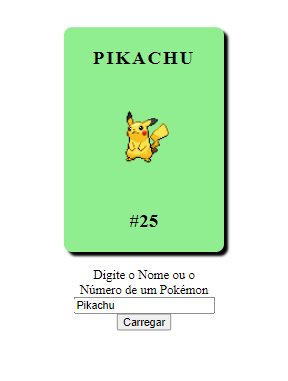

    

***Monte um time com os seus pokémons preferidos e aprenda sobre eles!***

 Utilizando a PokeAPI, este projeto front-end te permite criar um time com até 6 pokémons, exibindo informações sobre eles de maneira simples e objetiva! 

## A Ideia

Compartilhando da mesma paixão pelo universo Pokémon, Bruno Luna e Isaías Rodrigues decidem criar este projeto durante o bootcamp Fullstack Java Jr na Generation Brasil. Utilizamos alguns conceitos aprendidos durante o curso.

### Soft Skills

- Trabalho em Equipe;
- Comunicação
- Persistência
- Mentalidade de Crescimento
- Orientação ao Futuro

### Tecnologias

- 
- 

- 

## V1.0

O código da versão 1.0 é ensinado por André Luiz França Batista em duas vídeo aulas, disponibilizadas em seu canal homônimo (<a href="https://www.youtube.com/watch?v=X5fMPdnd3tw">link aula 1</a>).

- Implementamos o input para que o usuário pesquise um pokémon pelo nome ou número da pokedex.
- Ajuste no tamanho da imagem e na cor do card.

(Screenshot da aplicação v1.0)

## 👷‍♂️👷‍♂️:: Em costrução  por :: 🚧🚧

| [Bruno Luna](https://www.linkedin.com/in/bruno-luna-11590720a/) |   [Isaías Rodrigues](https://www.linkedin.com/in/isaiasz/)   |
| :----------------------------------------------------------: | :----------------------------------------------------------: |
|  |  |

